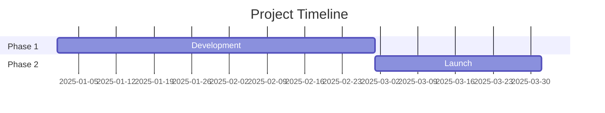
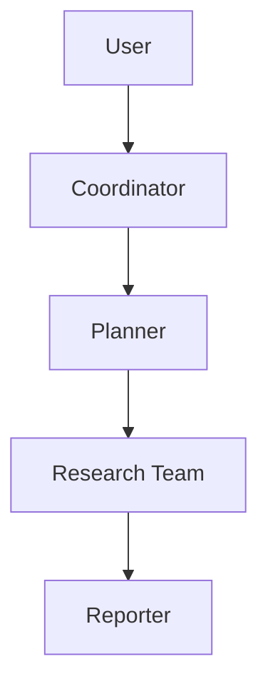
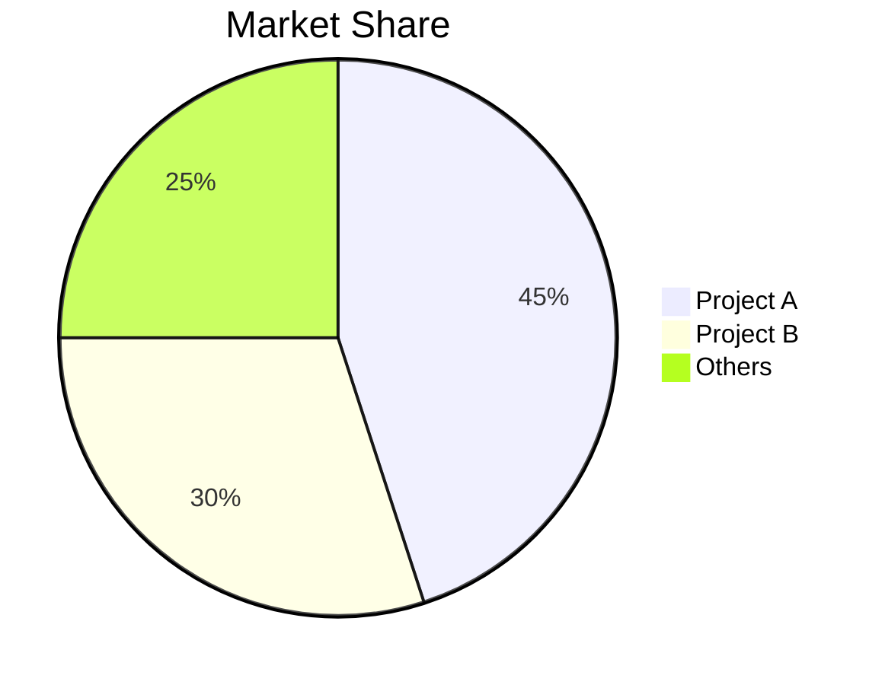

# GitHub Deep Research Skill

Multi-round research combining GitHub API, web_search, web_fetch to produce comprehensive markdown reports.

## Environment Notes

Adapt this skill to the current host before assuming all rounds are available.

- Prefer `gh` CLI when available and authenticated. In this environment, `gh auth status` may work even when anonymous `api.github.com` requests are rate-limited or return `403`.
- If direct GitHub API requests fail without a token, retry with `GITHUB_TOKEN` or `GH_TOKEN` if available.
- If neither token nor authenticated `gh` access is available, fall back to `web_fetch` for repo metadata and README-like public information, but clearly mark lower confidence.
- Prefer Tavily or any other working hosted discovery search in the current environment before relying on Brave-specific search.
- If `web_search` is unavailable because the host search provider is not configured, skip discovery searches instead of failing the whole workflow. Continue with GitHub-native evidence and direct web fetching.
- Treat discovery search as optional enrichment, not a hard prerequisite.

## Research Workflow

- Round 1: GitHub API or `gh` CLI
- Round 2: Discovery (optional if search is unavailable)
- Round 3: Deep Investigation
- Round 4: Deep Dive

## Core Methodology

### Query Strategy

**Broad to Narrow**: Start with GitHub-native data, then general queries, refine based on findings.

```
Round 1: GitHub API / gh CLI
Round 2: "{topic} overview"
Round 3: "{topic} architecture", "{topic} vs alternatives"
Round 4: "{topic} issues", "{topic} roadmap", "site:github.com {topic}"
```

**Source Prioritization**:
1. Official docs/repos (highest weight)
2. GitHub-native metadata (`gh` CLI, repo API, releases, issues, commits)
3. Technical blogs (Medium, Dev.to)
4. News articles (verified outlets)
5. Community discussions (Reddit, HN)
6. Social media (lowest weight, for sentiment)

### Research Rounds

**Round 1 - GitHub-native extraction**
Prefer the following order:

1. `gh` CLI if authenticated:
```bash
gh repo view <owner>/<repo> --json name,description,stargazerCount,forkCount,primaryLanguage,licenseInfo,createdAt,updatedAt,pushedAt,url
gh repo view <owner>/<repo> --readme
gh release list --repo <owner>/<repo> --limit 10
gh issue list --repo <owner>/<repo> --limit 20 --state all
gh pr list --repo <owner>/<repo> --limit 20 --state all
gh api repos/<owner>/<repo>/commits?per_page=20
python /path/to/skill/scripts/github_cli_summary.py <owner> <repo>
```

2. Skill script with token support if available:
```bash
python /path/to/skill/scripts/github_api.py <owner> <repo> summary
python /path/to/skill/scripts/github_api.py <owner> <repo> readme
python /path/to/skill/scripts/github_api.py <owner> <repo> tree
```

3. `web_fetch` fallback on the public repo page if both methods above fail.

**Available commands (the last argument of `github_api.py`):**
- summary
- info
- readme
- tree
- languages
- contributors
- commits
- issues
- prs
- releases

**Round 2 - Discovery (optional 3-5 web_search)**
- Get overview and identify key terms
- Find official website/repo
- Identify main players/competitors
- If `web_search` is unavailable, skip this round and continue

**Round 3 - Deep Investigation (web_search + web_fetch, or web_fetch only)**
- Technical architecture details
- Timeline of key events
- Community sentiment
- Use web_fetch on valuable URLs for full content
- If search is unavailable, pivot from repo README / docs links / release notes / linked websites

**Round 4 - Deep Dive**
- Analyze commit history for timeline
- Review issues/PRs for feature evolution
- Check contributor activity

## Report Structure

Follow template in `assets/report_template.md`:

1. **Metadata Block** - Date, confidence level, subject
2. **Executive Summary** - 2-3 sentence overview with key metrics
3. **Chronological Timeline** - Phased breakdown with dates
4. **Key Analysis Sections** - Topic-specific deep dives
5. **Metrics & Comparisons** - Tables, growth charts
6. **Strengths & Weaknesses** - Balanced assessment
7. **Sources** - Categorized references
8. **Confidence Assessment** - Claims by confidence level
9. **Methodology** - Research approach used

### Mermaid Diagrams

Include diagrams where helpful:

**Timeline (Gantt)**:


**Architecture (Flowchart)**:


**Comparison (Pie/Bar)**:


## Confidence Scoring

Assign confidence based on source quality:

| Confidence | Criteria |
|------------|----------|
| High (90%+) | Official docs, GitHub data, multiple corroborating sources |
| Medium (70-89%) | Single reliable source, recent articles |
| Low (50-69%) | Social media, unverified claims, outdated info |

If the workflow had to skip search or use HTML fallback instead of GitHub-native extraction, reduce confidence accordingly and say so explicitly.

## Output

Save report as: `research_{topic}_{YYYYMMDD}.md`

### Formatting Rules

- Chinese content: Use full-width punctuation（，。：；！？）
- Technical terms: Provide Wiki/doc URL on first mention
- Tables: Use for metrics, comparisons
- Code blocks: For technical examples
- Mermaid: For architecture, timelines, flows

## Best Practices

1. **Start with official sources** - Repo, docs, company blog
2. **Prefer `gh` over anonymous GitHub API** when the local host is already authenticated
3. **Verify dates from commits/PRs** - More reliable than articles
4. **Triangulate claims** - 2+ independent sources where possible
5. **Note conflicting info** - Don't hide contradictions
6. **Distinguish fact vs opinion** - Label speculation clearly
7. **Always include inline citations** - Use `[citation:Title](URL)` format immediately after each claim from external sources
8. **Extract URLs from search results** - web_search returns {title, url, snippet} - always use the URL field
9. **Degrade gracefully** - if search is unavailable, continue with GitHub-native evidence instead of aborting
10. **Update as you go** - Don't wait until end to synthesize

### Citation Examples

**Good - With inline citations:**
```markdown
The project gained 10,000 stars within 3 months of launch [citation:GitHub Stats](https://github.com/owner/repo).
The architecture uses LangGraph for workflow orchestration [citation:LangGraph Docs](https://langchain.com/langgraph).
```

**Bad - Without citations:**
```markdown
The project gained 10,000 stars within 3 months of launch.
The architecture uses LangGraph for workflow orchestration.
```
